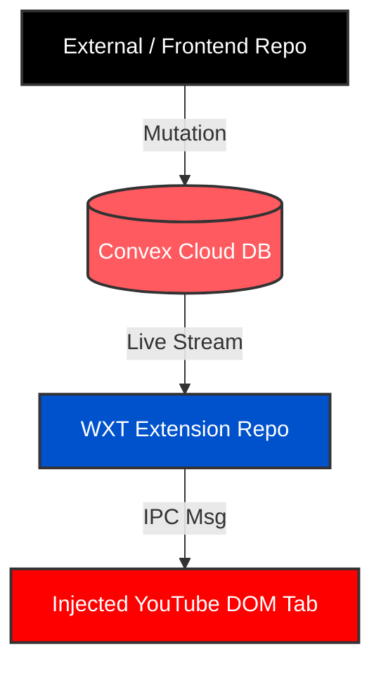

> v0.0.0

# WXT Chrome Extension (YouTube Headless Remote Receiver)

**CURRENT REPOSITORY ROLE:** This is the **WXT Browser Extension Repo**. It functions as a headless client running inside the browser that listens to real-time events and manipulates YouTube tabs.

## Tech Stack & Structure

- **Framework:** WXT (Next-Gen Web Extension Framework) with React & TypeScript.
- **Key Entrypoints:**
  - `entrypoints/background.ts` (Headless Convex background worker)
  - `entrypoints/content.ts` (Injected DOM manipulation runner)
  - `entrypoints/popup/App.tsx` (Local Extension UI / Testing Controller)

## Coding Rules & Constraints (For This Repo Only)

1. **NO UI Providers in Background:** This script runs inside an isolated Manifest V3 Service Worker. There is no `window` or `document` context. You **cannot** use standard React-dependent hooks like `useQuery` or wrap things in `<ConvexProvider>` here.
2. **Headless Convex Client Only:** You must strictly pull the database subscription stream using the vanilla JavaScript connector: `import { ConvexClient } from "convex/browser";`.
3. **Keep-Alive Loop Required:** Manifest V3 background workers sleep aggressively after ~30 seconds. You must utilize the `chrome.alarms` API to pulse periodically and ensure the active `convex.onUpdate` stream stays alive.
4. **Idempotency Check:** Always compare incoming event timestamps against an in-memory `lastExecutedTimestamp` checkpoint to avoid executing stale history items when the script re-awakens.
5. **The Popup is Ephemeral (UI Rule):** If you build a visual controller inside the extension toolbar (`entrypoints/popup`), you **can** use standard React and `@convex/react` because the popup has a full HTML DOM. However, the popup only mounts and runs when physically clicked. The split second the user clicks away, the popup DOM is entirely destroyed. Use it primarily for local Phase 1 testing (e.g., creating a temporary button that sends a `chrome.runtime.sendMessage` to `background.ts`) or displaying active connection status, rather than hosting persistent background listeners.

---

---

# YouTube Serverless Remote Controller (Cross-Repository Anchor)

This repository forms one half of a serverless, cross-device remote control system designed to manipulate YouTube playback. By utilizing Convex as a reactive data sync broker, this architecture eliminates the need for maintaining an always-on, stateful WebSocket backend container (like Node.js or Go).

## The Architecture & Data Flow

Instead of raw socket routing, state synchronization is treated as a fully reactive data pipeline:

1. **The External Controller Repo (Next.js/React)** pushes a command intent into a global database cloud table via a Convex mutation.
2. **The Convex Cloud Layer** instantly streams the database change event down to all matching active subscribers.
3. **The WXT Browser Extension Repo (Background Service Worker)** acts as a headless cloud subscriber, catching the live mutation update and messaging the injected content scripts to alter the target YouTube tab's DOM.

```
[ External / Frontend Repo ] ──( Mutation )──> [ Convex Cloud DB ]
                                                        │
                                                 ( Live Stream )
                                                        ▼
[ Injected YouTube DOM Tab ] <──( IPC Msg )── [ WXT Extension Repo ]
```




## Shared Contract: Database Schema

To maintain absolute strict synchronization across both repositories, any mutation pushed by the Frontend UI must map exactly to the data structure monitored by the WXT background worker.

The implicit shared table structure in Convex is defined as:

- `roomId` (string, indexed): A unique string pairing the controller device to the matching extension browser session.
- `action` (string): The media directive to execute. Allowed string literals: `"PLAY"`, `"PAUSE"`, `"NEXT"`, `"PREV"`, `"OPEN_LINK"`.
- `url` (optional string): The targeted YouTube destination to populate when `action` is set to `"OPEN_LINK"`.
- `timestamp` (number): A Unix epoch milliseconds integer checkpoint (`Date.now()`).

## Cross-Repo Architectural Constraints & Fixes

When developing or modifying either codebase, the following native platform limitations must be respected:

1. **Extension Headless Execution:** The WXT background script runs in an isolated service worker context without access to `window` or `document` objects. Therefore, it cannot utilize React hooks like `useQuery` or `ConvexProvider`. It must strictly use the standalone JavaScript client via `import { ConvexClient } from "convex/browser"`.
2. **Service Worker Dormancy:** Chrome aggressively suspends Manifest V3 service workers after roughly 30 seconds of idleness, which drops active database streams. The WXT repo solves this by using the `chrome.alarms` API to pulse every 30 seconds, ensuring the background script wakes up and verifies that the Convex database listener is live.
3. **Idempotency Execution Check:** When the extension reconnects or restarts, Convex will stream the latest document in history. To prevent re-executing an old directive (e.g., pausing a video that was paused hours ago), the extension background worker maintains an in-memory `lastExecutedTimestamp` variable. It will immediately ignore any incoming document whose timestamp is less than or equal to this checkpoint.
